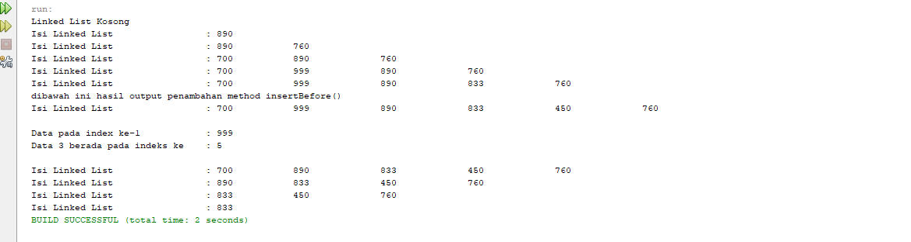
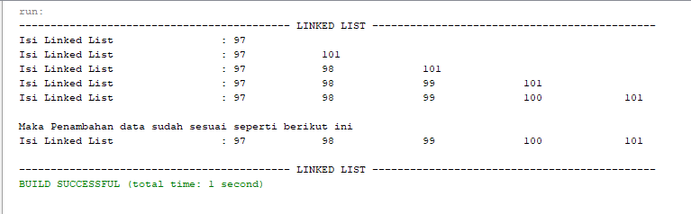
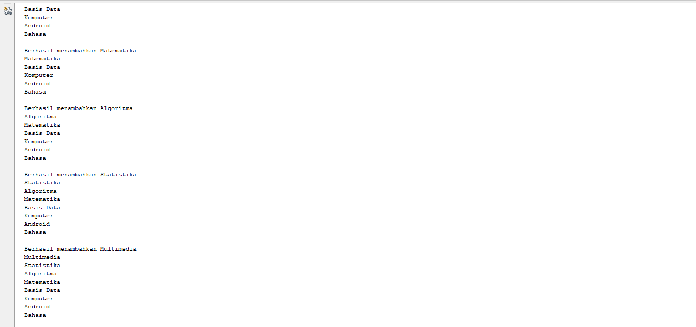
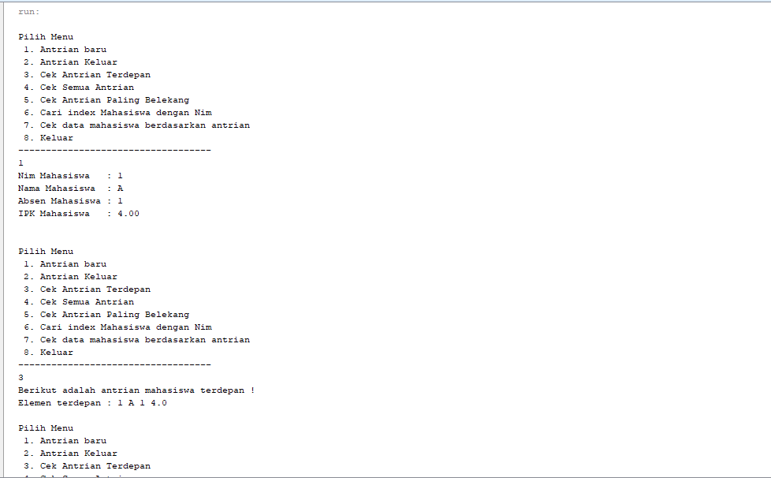

# Laporan Praktikum 
Oleh : Muhammad Islahuddin 2141720268

## Jawaban Pertanyaan

### Sub Bab 9.2.3
1. Karena linked list (node) masih belum memiliki isi / data, dimana pada sllMain langsung dilakukan pemanggilan method print diawal pemanggilan yang mana node masih belum di isi data sama sekali, sehingga system akan menampilkan "Linked List Kosong".
2. Kegunaan potongan kode diatas adalah jika temp.data sama dengan key, maka kode program otomatis mengubah nilai variabel ndInput.next menjadi variabel temp.next serta nantinya pada variable ndInput untuk menyimpan nilainya.
3. Kegunaan potongan kode diatas adalah jika temp.next.next == nul maka akan mengembalikan nilai -1 atau data kosong, dan jika tidak ada kondisi yang terpenuhi sama sekali maka akan mengembalikan nilai dari index yaitu 0.

### Sub Bab 9.3.3
1. Karena keyworad break tersebut berfungsi untuk menghentikan perulangan / loop. terdapat dua break yang ada pada method remove, break yang pertama berfunsgsi untuk jika data yang dihapus ada pada head dan ditemukan maka program akan langsung break, break yang kedua berfungsi untuk jika data yang dihapus berada ditengah dan ditemukan maka program akan langsung break.
2. Potongan kode diatas berfungsi untuk jika node yang dipilih memiliki data yang sama (equals) dengan key, maka terjadi perubahan posisi dimana node tersebut akan digantikan oleh node yang selanjutnya.
3. Didalam method indexOf terdapat 2 return, yaitu :
- jika tmp == null maka akan mengembalikan nilai -1 atau data kosong.
- jika tidak ada kondisi yang terpenuhi sama sekali maka akan mengembalikan nilai index yaitu 0.

### Tugas
1. 
2. 
3. 
4. 

&copy islaarema31
