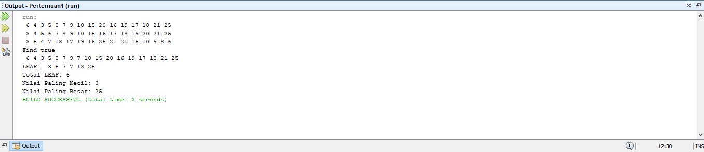
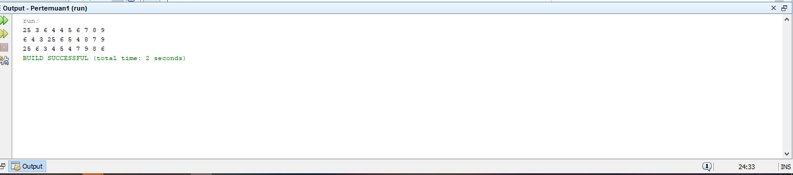

# Laporan Praktikum Pertemuan 3
Oleh : Muhammad Islahuddin 2141720268

## Jawaban Pertanyaan

### Sub Bab 2.1.2

1. Karena pada Binary Search Tree terdapat aturan bahwa setiap child node sebelah kiri selalu lebih kecil nilainya dari pada root node. Begitu pula sebaliknya.
2. Untuk menentukan leftchild dan reightchild. kegunaan left dan right sama seperti next dan prev.
3. a. Kegunaan dari root adalah untuk menentukan nilai paling atas.
b. Null atau kosong.
4. Proses penginputan node ke dalam root.
5. Jika data baru kurang dari data lama maka di lakukan pengecekan lagi apakah data 
kiri bernilai sama dengan null, jika iya data lama akan maka akan masuk ke dalam data kiri, 
jika tidak maka data kiri di ganti dengan data yang baru saja di masukkan.

### Sub Bab 13.2.1
1. Data untuk mendeklarasikan banyaknya nilai array dan IdxLast untuk menentukan alamat agar tidak eror waktu add.
2. Untuk menginput data agar dikenali indexnya.
3. Untuk mengeprint secara inOrder atau mengeprint seluruh data pada tree secara rekursif mulai dari sebelah kiri.
4. Left = 1 dan right 3.
5. Untuk melimit index agar hanya menjadi 6.

### Latihan Praktikum

&copy islaarema31
