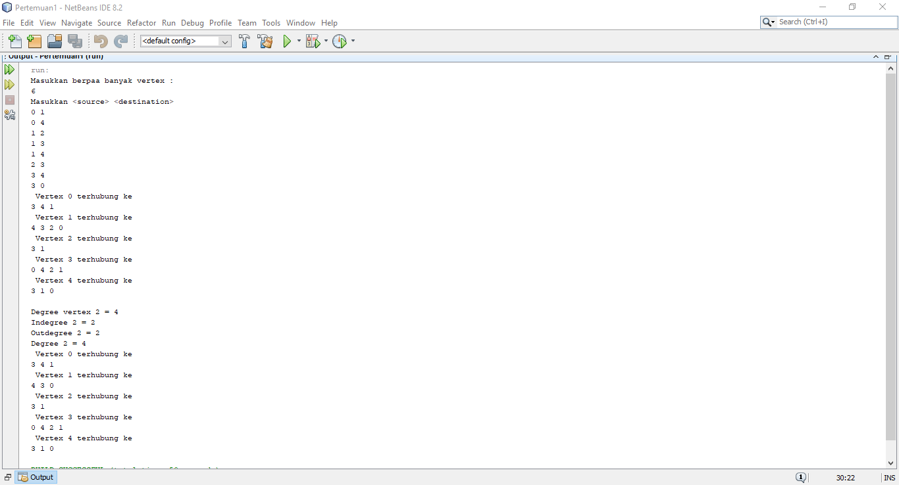
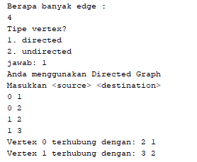
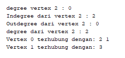
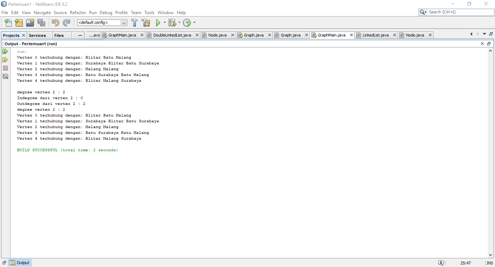

# Laporan Praktikum 
Oleh : Muhammad Islahuddin 2141720268

## Jawaban Pertanyaan

### Sub Bab 12.2.3
1. - Pencarian Melebar (Breadth First Search atau BFS) Untuk Mencari.
- Pencarian Mendalam (Depth First Search atau DFS) Untuk Mencari.
- Algoritma Bellman-Ford Untuk mencari lintasan terpendek.
- Algoritma Boruvska Untuk menentukan pohon penjangkau minimum.
2. Untuk memanggil objek Linkedlist dan mengubahnya menjadi objek array yang mana 
nantinya akan di isi oleh vertex.
3. Alasannya adalah untuk dapat mengenalkan data dari depan.
4. Dengan cara looping edge, jika vertex lebih besar dari I dan destination sama dengan I maka edge akan otomatis di hapus.
5. Output tidak error tapi data vertex yang di keluarkan mengalami perubahan path / lintasan.

### Sub Bab 12.3.3
1. Directed gaph degree mempunyai nilai yang berbeda karena terdapat in out Sedangkan undirected degree mempunyai nilai yang sama karena tidak terdapat in out.
2. Karena pada matriks index di mulai dari 0, agar vertex dalam matrix bernilai sama dengan vertex yang seharusnya maka harus di tambah +1.
3. Untuk menampilkan apakah vertex tersedia atau tidak.
4. Jenis directed graph.
5. Agar program yang error dapat tetap berjalan dan tidak terhenti.

### Tugas
1. 
2. 
3. 
4. 

&copy islaarema31
