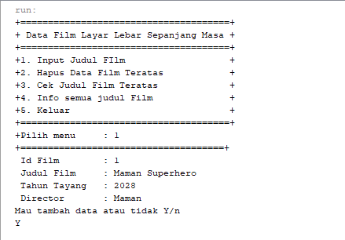
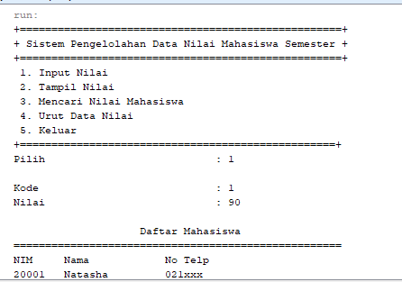

# Laporan Praktikum 
Oleh : Muhammad Islahuddin 2141720268

## Jawaban Pertanyaan

### Sub Bab 16.2.3
1. Karena pada saat deklarasi ArrayList tidak disebutkan tipe data spesifik.
2. 
```java
    List<Integer> l = new ArrayList<>();
    l.add(1);
    l.add(2);
    l.add(3);
    l.add(4);
```
3. 
```java 
    LinkedList<String> names = new LinkedList<>();
    names.add("Noureen");
    names.add("Akhleema");
    names.add("Shannum");
    names.add("Uwais");
    names.add("Al-Qarni");
``` 

4.  
```java
LinkedList<String> names = new LinkedList<>();
    names.add("Noureen");
    names.add("Akhleema");
    names.add("Shannum");
    names.add("Uwais");
    names.add("Al-Qarni");
    System.out.printf("Elemen 0 : %s total elemen : %s elemen terakhir : %s\n", 
            names.get(0), names.size(), names.get(names.size() - 1));
    names.set(0, "My Kid");
    System.out.printf("Elemen 0 : %s total elemen : %s elemen terakhir : %s\n", 
            names.get(0), names.size(), names.get(names.size() - 1));
    System.out.println("Names : "+ names.toString());
    
    names.push("Mei-mei");
    System.out.printf("Elemen 0: %s total elemen : %s elemen terakhir : %s\n",
            names.getFirst(), names.size(), names.getLast());
    System.out.println("Names : "+ names.toString());
```
5. Fungsi "push" berfungsi untuk menambahkan elemen pada posisi terdepan.

### Sub Bab 16.3.3
1. Fungsi add akan menambahkan elemen pada bagian paling belakang, sedangkan fungsi push akan menambahkan elemen di posisi terdepan.
2. Stack tidak akan terisi elemen baru, karena semua elemen stack baru saja dihapus dengan fungsi pop.
3. Baris kode tersebut akan melakukan print elemen stack dengan menggunakan format dan memanfaatkan syntax foreach untuk melakukan perulangan.
4. Akan terjadi error, karena yang dapat dijadikan object adalah percabangan dari List, bukan List itu sendiri.
5. 
```java
        fruits.push("Melon");
        fruits.push("Strawberry");
        System.out.println("");
        for(Iterator<String> it = fruits.iterator(); it.hasNext();){
            String fruit = it.next();
            System.out.printf("%s ", fruit);
        }
```
6. 
```java
        fruits.push("Manggo");
        fruits.push("Guava");
        fruits.push("Avocado");
    
        System.out.println("");
        System.out.println("\nData sesudah disorting ");
        Collections.sort(fruits);
        Iterator i= fruits.iterator();
    
        while(i.hasNext()){
            System.out.print(i.next() + "  ");
            System.out.println("");
```

### Sub Bab 16.4.3
1. Konsep yang digunakan adalah penggunaan parameter array yang panjangnya akan mengikuti banyaknya nilai parameter yang dimasukkan, kelebihannya adalah fleksibilitas penambahan elemen jika tidak diketahui dengan pasti berapa banyak elemen yang harus ditambahkan.
2. 
```java
int binarySearch(String nim){
    return Collections.binarySearch(mahasiswas, new mahasiswa(nim, null, null), new Comparator<mahasiswa>(){
        @Override
        public int compare(mahasiswa o1, mahasiswa o2){
            return o1.nim.compareTo(o2.nim);
        }
    });
}
```
3. 
Asc
```java
void ascSort(){
    Collections.sort(mahasiswas, new Comparator<mahasiswa>(){
        @Override
        public int compare(mahasiswa o1, mahasiswa o2){
            return o1.nim.compareTo(o2.nim);
        }
    });
}
```
Desc
```java
void dscSort(){
    Collections.reverse(mahasiswas);
}
```

### Tugas
1. 
2. 

<center>&copy islaarema31</center>