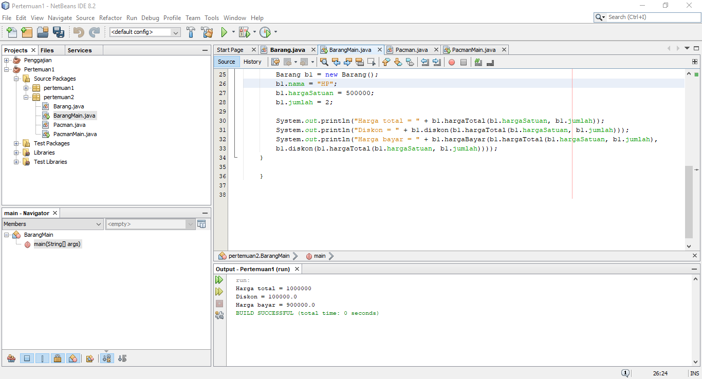
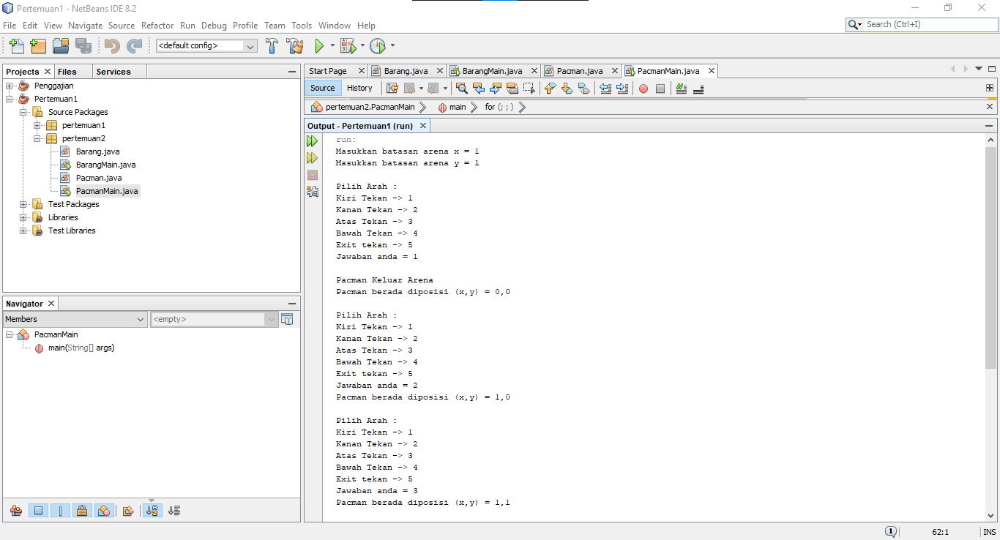

# Laporan Praktikum Pertemuan 2
Oleh : Muhammad Islahuddin 2141720268

## Jawaban Pertanyaan

### Sub Bab 2.2

1. <ul>
    <li>Karakteristik Class : Class merupakan suatu rancangan yang tidak memiliki bentuk nyata dan atribut pada class bersifat umum dan tidak memiliki nilai spesifik.</li>
    <li>Karakteristik Object : Object merupakan bentuk nyata dari class dan atribut dari object bersifat spesifik dan memiliki nilai yang spesifik.</li>
</ul>

2. Untuk mendeklasrasikan class menggunakan kata kunci "class".
3. Ada 4 yaitu namaBarang, jenisBarang, stok dan hargaSatuan yang berada di baris ke 13 dan 14.
4. Ada 4 yaitu tampilBarang, tambahStok, kurangiStok dan hitungHargaTotal yang berada di baris ke 16,23,27 dan 31.
5. void kurangiStok(int n){
        if(n>0){
        stok=stok-n;
        }else{  
        }
6. Karena digunakan mengembalikan nilai n.
7. Untuk mengembalikan nilai integer.
8. Tidak ada yang di returnkan.

### Sub Bab 2.3

1. Pada baris ke 15 dan nama objek yang dihasilkan adalah b1.
2. Dengan memanggil nama objek yang telah di instansiasi lalu ketikan atribut atau method.

### Sub Bab 2.4
1. Baris 18
2. Instansiasi konstruktor berparameter dengan nama objek baru yaitu b2
3. Barang b3 = new Barang("Minyak kayu putih", "Obat", 3, 5000);

### Latihan Praktikum
1. 
2. 

&copy islaarema31
