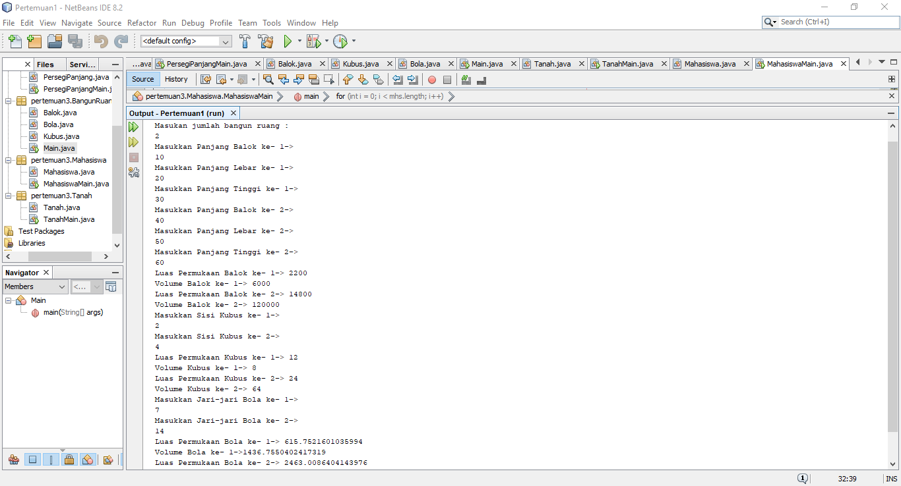
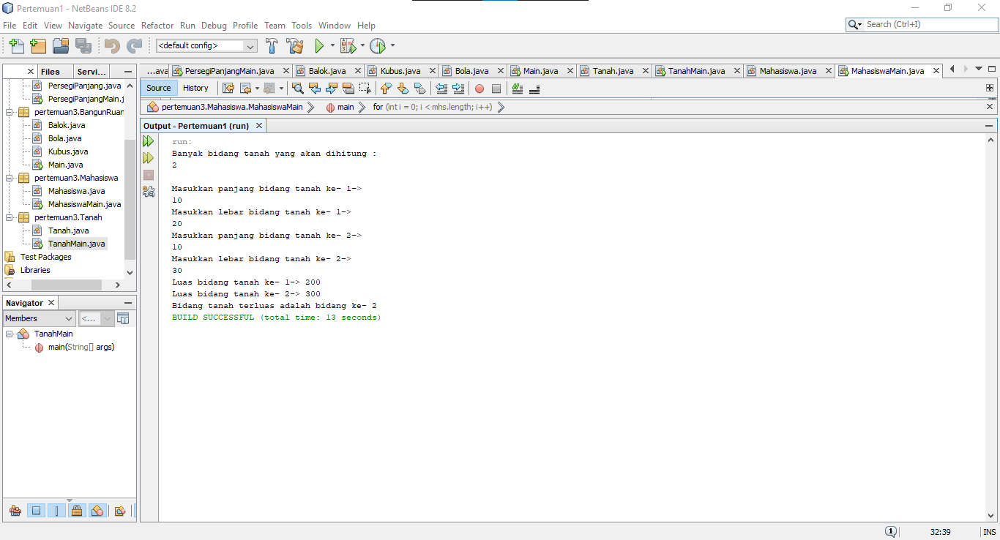
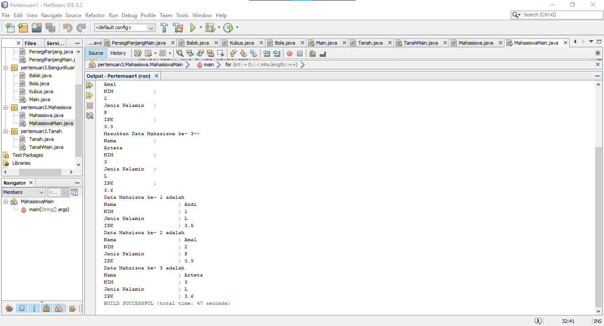

# Laporan Praktikum Pertemuan 3
Oleh : Muhammad Islahuddin 2141720268

## Jawaban Pertanyaan

### Sub Bab 3.2
1. Tidak karena array of object hanya harus memliki atribut tidak harus selalu memiliki method.
2. Untuk membuat objek PersegiPanjang ke index array 1.
3. Mendeklarasikan array ppArray dengan jumlah array 3.
4. Kode tersebut adalah array kedua yang dilakukan input.
5. Karena untuk memudahkan mana kelas dan kelas main.

### Sub Bab 3.3
1. Bisa
2.  ``` java
     manusia[][] m = new manusia[1][1];
     m[0][0] = new manusia();
     ``` 
3. Karena belum membuat objek pada index array 5. Seharusnya setelah line 1 ada line seperti berikut : 

    ``` java
    pgArray[5] = new Persegi();
    ```  
4. ``` java
    System.out.print("Masukkan panjang array : ");
    int arrLength = sc.nextInt();
    PersegiPanjang[] ppArray = new PersegiPanjang[arrLength];
    ```
5. Boleh, namun program tidak efisien.

### Sub Bab 3.4
1. Dapat
    ``` java
    public class Film{
        int episode;
        public Film(){

        }
        public Film(int x) {
            episode = x;
        }
    }
    ```
2.  ``` java
    public class Segitiga{
        public int alas;
        public int tinggi;
        
        public Segitiga(int a, int t){
            alas = a;
            tinggi = t;
        }
    }
    ```
3.  ``` java
    public class Segitiga{
        public int alas;
        public int tinggi;
        
        public Segitiga(int a, int t){
            alas = a;
            tinggi = t;
        }

        int hitungLuas(){
            int luas = (alas*tinggi)/2;
            return luas;
        }

        double hitungKeliling(){
            double keliling = Math.sqrt(((alas*0.5)*(alas*0.5))+(tinggi*tinggi))*2+alas;
        }
    }
    ```
4. ``` java
        public class SegitigaMain{
            public static void main(String[] args){
                Segitiga[] sgArray = new Segitiga[4];
                for (int i = 0 ; i < sgArray.length ; i++){
                    sgArray[i] = new Segitiga();
                }
                sgArray[0].alas = 10;
                sgArray[0].tinggi = 4;
                sgArray[1].alas = 20;
                sgArray[1].tinggi = 10;
                sgArray[2].alas = 15;
                sgArray[2].tinggi = 6;
                sgArray[3].alas = 25;
                sgArray[3].tinggi = 10;
            }
        }
    ```
5. ``` java
        public class SegitigaMain{
            public static void main(String[] args){
                Segitiga[] sgArray = new Segitiga[4];
                for (int i = 0 ; i < sgArray.length ; i++){
                    sgArray[i] = new Segitiga();
                }
                sgArray[0].alas = 10;
                sgArray[0].tinggi = 4;
                sgArray[1].alas = 20;
                sgArray[1].tinggi = 10;
                sgArray[2].alas = 15;
                sgArray[2].tinggi = 6;
                sgArray[3].alas = 25;
                sgArray[3].tinggi = 10;

                for (int i = 0 ; i < sgArray.length ; i++){
                    System.out.println("Luas Segitiga ke - " + (i+1) + " adalah : " + 
                    sgArray[i].hitungLuas());
                    System.out.println("Keliling Segitiga ke - " + (i+1) + " adalah : " + 
                    sgArray[i].hitungKeliling());

                }
            }
        }

    ```
### Latihan Praktikum
1. 
2. 
3. 

<center>&copy islaarema31</center>