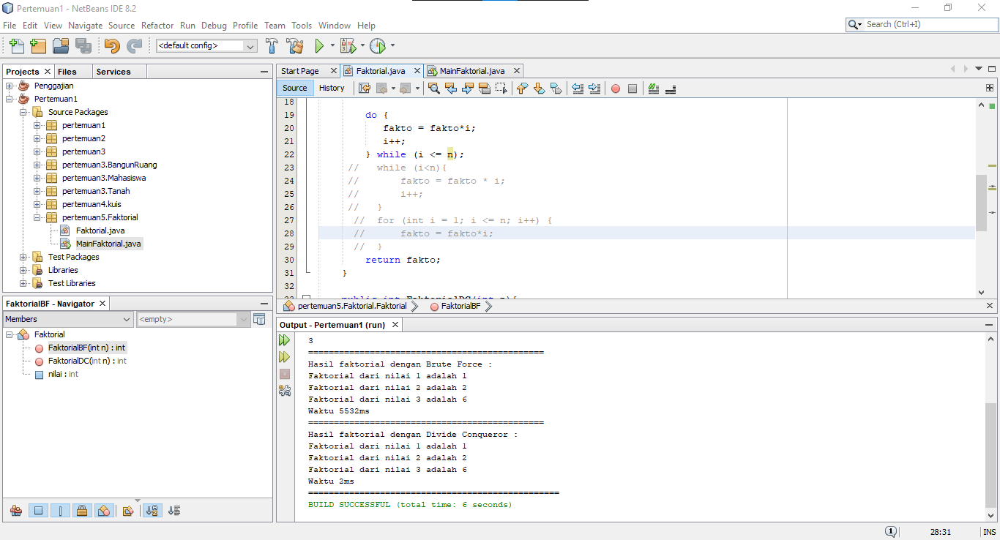
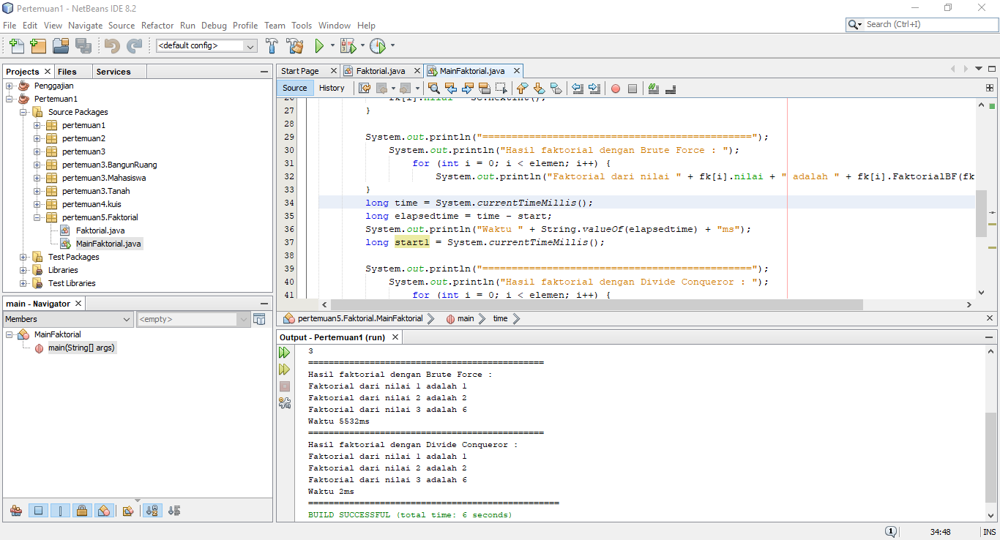
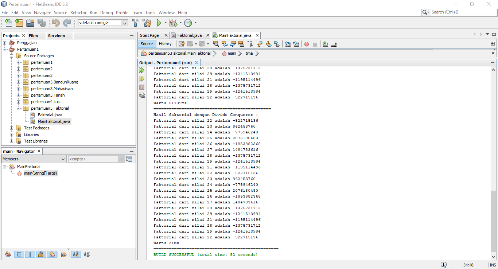
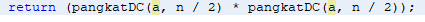
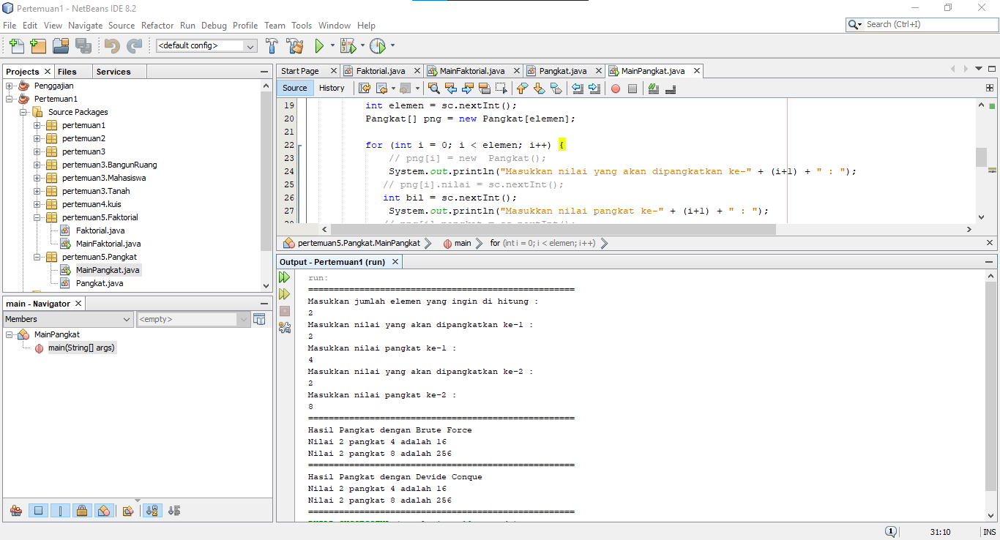
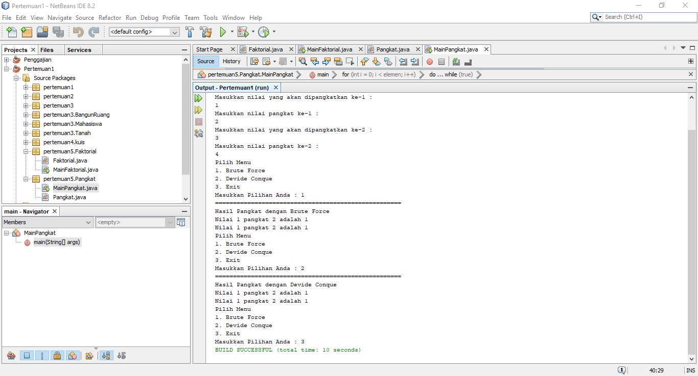
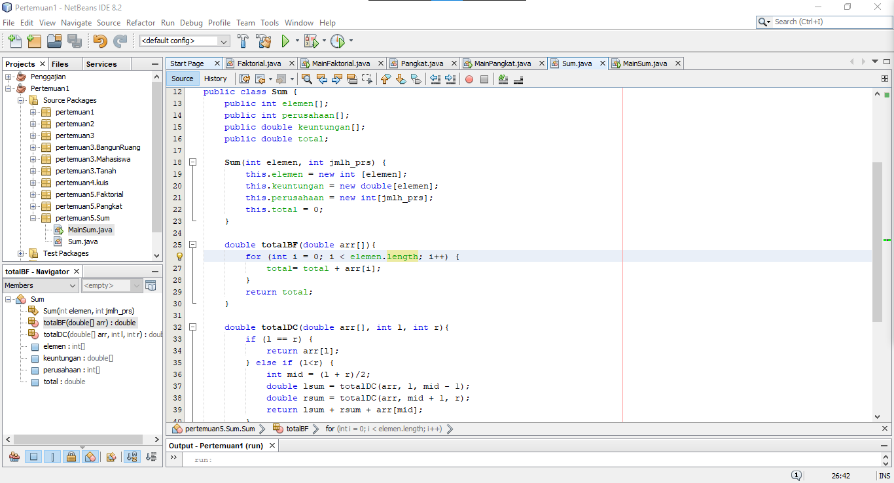
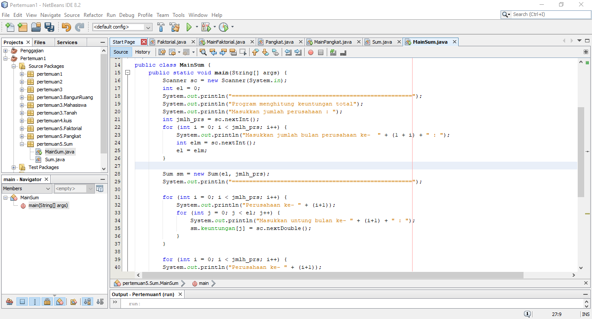
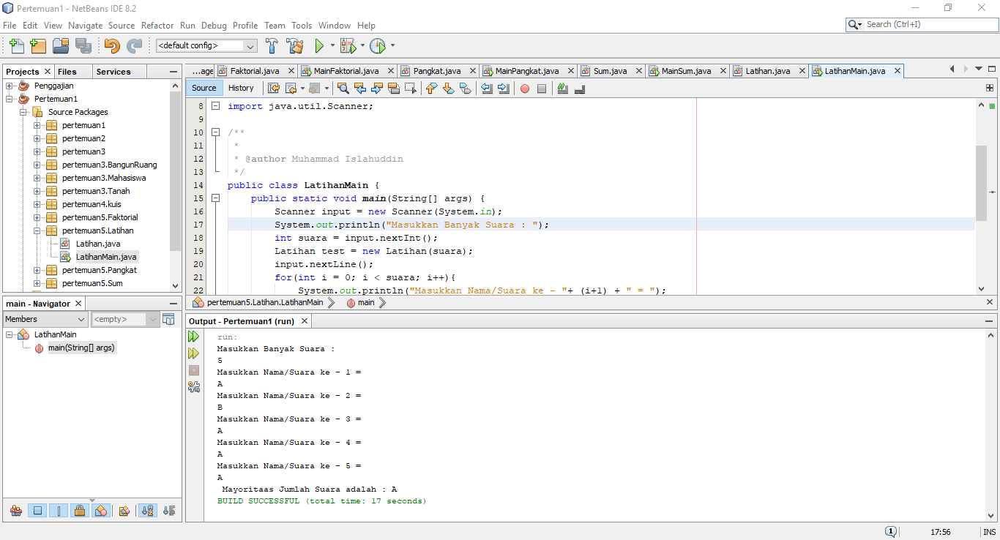

# Laporan Praktikum Pertemuan 3
Oleh : Muhammad Islahuddin 2141720268

## Jawaban Pertanyaan

### Sub Bab 4.2
1. Karena jika nilai dari n sudah equals atau sama dengan 1, maka program akan 
melakukan return 1, kemudian jika tidak maka nilai daripada variable n akan di kurang -
1,yang mana di setiap loop atau perulangan yang di lakukan pada method di kalikan 
dengan nilai sebelumnya dan kemudian program akan mereturn pada variable fakto 
2.  - Divide = faktorialDC(n-1) pengurangan pada nilai n.
- Conquer = n*.faktorialDC(n-1) penyelesaian dengan rekursif. 
- Combine = n*faktorialDC(n-1) pengombinasian dengan perkalian.
3. Memungkinkan dengan dirubah menggunakan while dan do while.
- Contoh :

4. 
5. 

### Sub Bab 4.3
1. Perbedaan dari method PangkatBF() dan PangkatDC yakni pada method pangkatBF() menggunakan fungsi iterative, sedangkan pada method pangkatDC() menggunakan fungsi rekursif.
2. Maksud dari potongan tersebut yakni apabila terdapat suatu bilangan ganjil maka program akan melakukan pembagian terhadap variuable n, yakni dibagi 2 kemudian dikalikan dengan method itu sendiri dan kemudian di kalikan lagi dengan variable a.Namun apabila terdapat suatu bilangan genap maka program akan melakukan return/nilai balik dan di dalam return tersebut dilakukan pembagian terhadap variable n, yang mana variable n di bagi 2 dan kemudian di kalikan dengan method itu sendiri namun tidak dikalikan dengan nilai daripada variable a.
3. Tahap combine sudah terjadi pada kode tersebut, dan lebih tepatnya tahapan tersebut di lakukan pada class Pangkat
- Contoh :

4. 

5. 

### Sub Bab 4.3
1. - Perbedaan perhitungan yang terjadi pada method TotalBF() yakni, kode program terkesan lebih ringkas dan sederhana.
- Perbedaan perhitungan yang terjadi pada method TotalDC() yakni, kode program lebih panjang daripada kode program pada method TotalBF(),namun method ini memiliki keuntungan yang mana pada method ini kita dapat memecahkan masalah.
2. Dengan cara mengganti syntax println menjadi syntax printf dan juga teknik pembatasan karakter.
3. Return value tersebut berguna untuk mengembalikan nilai dari variable lsum,variable rsum dan juga arr [mid] yang mana masing-masing nya di jumlah kan terlebih dahulu.
4.  Di butuhkan variable mid pada method TotalDC() yakni guna menampng nilai dari perhitungan (1+r)/2 yang mana nantinya akan gi gunakan sebagai pengisian nilai pada parameter di method TotalDC().
5. 
   

### Latihan Praktikum
1. 

&copy islaarema31
