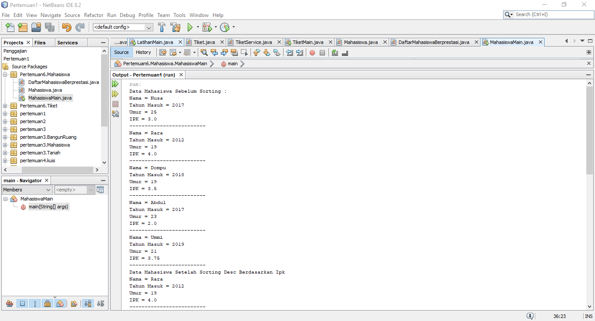

# Laporan Praktikum Pertemuan 6
Oleh : Muhammad Islahuddin 2141720268

## Jawaban Pertanyaan

### Sub Bab 5.2
1. Terdapat pada method void bubbleSort().
2. Terdapat pada method void selectionSort.
3. Proses swap adalah proses untuk menukarkan nilai.
4. Untuk proses swap atau pertukaran. Nilai akan dibandingkan terlebih dahulu dengan indeks setelahnya apabila nilai lebih besar maka akan ditukar.
5. A. Jika perulangan I digunakan untuk mengeloop array dan J untuk mengeloop array sesudah array I agar bisa di bandingkan.
B. Karena ada perulangan J yang mengeloop sampai listmhs, saat i = 0 maka akan di loop sampai array.length - 0  yang berarti di loop j pertama dari 1 sampai array.length.
C. Karena untuk membandingkan dengan array i.
D. 49 for dan 1225 tahapan.

### Latihan Praktikum
1. 

&copy islaarema31
