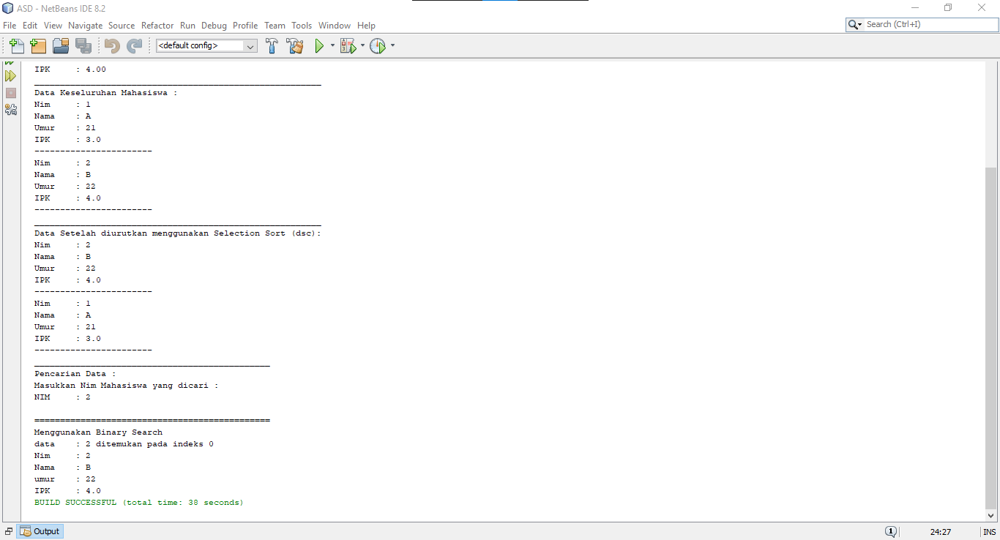
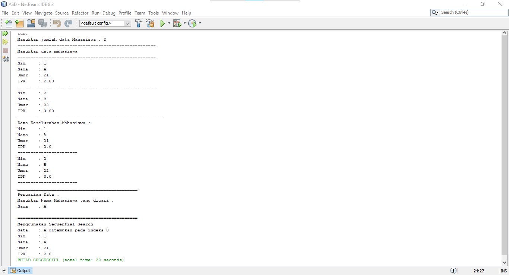
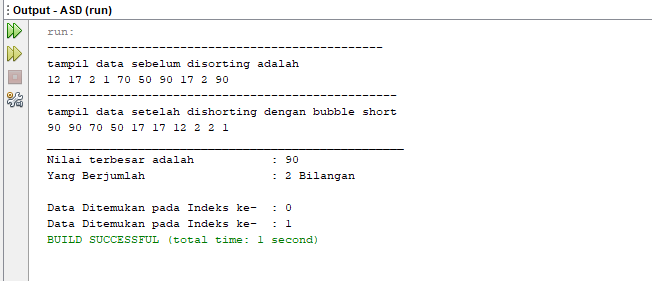

# Laporan Praktikum 
Oleh : Muhammad Islahuddin 2141720268

## Jawaban Pertanyaan

### Sub Bab 6.2.3
1. method Tampil Data || TampilData(int x,int pos) :void adalah sebuah method yang digunakan untuk menampilkan data yang ingin dicari oleh pengguna, dimana pengguna memasukan Nim dan kemudian akan di proses dan menampilkan data berupa NIM, NAMA, UMUR, IPK. apabila nim yang dimasukkan tidak ada pada program, maka method tampil data ini akan menampilkan output seperti berikut "Data "+ x +" Tidak ditemukan".

method TampilPosisi || Tampilpoisisi(int x,int pos): void adalah sebuah method yang digunakan untuk menampilan posisi data yang ingin dicari oleh pengguna, dimana disaat pengguna memasukkan nim kdan meudian akan di proses dan menampilkan posisi data yang dicari berada pada index ke berapa, apabila nim yang dimasukkan tidak ada pada program, maka method tampil data ini akan menampilkan output seperti berikut "data\t"+ x +" tidak ditemukan".
2. Fungsi Break pada program diatas berfungsi apabila/jika listMhs[j].nim sama dengan variable cari atau data listMhs[j] berhasil ditemukan. maka fungsi break adaah menghentikan perulangan pencarian data. karena data yang dicari sudah ditemukan.
3. Ya Dapat Berjalan, Ya Hasil yang dikeluarkan Benar, Karena pada algoritma Sequential Search dilakukan Proses pencarian dilakukan dengan membandingkan elemen array satu per satu secara beruntun mulai dari elemen pertama sampai elemen yang dicari sudah ditemukan atau sampai semua elemen sudah diperiksa sehingga Kumpulan data tidak harus dalam keadaan terurut program tetap bisa dijalankan berikut adalah bukti programnya.

### Sub Bab 6.3.3
1. Divede adalah dimana terjadi Proses pembagian dilakukan, pada source code saya terdapat pada class "PencarianMahasiswa" pada baris ke 59.
2. Conquer adalah dimana terjadi proses pengurutan dilakukan, pada source code saya terdapat pada class "PencarianMahasiswa" pada baris ke 62 - 66.
3. Program masih dapat di Run, akkan tetapi data yang dicari tidak dapat ditemukan karena pada algoritma BinarySearch Teknik pencarian = data dibagi menjadi dua bagian untuk setiap kali proses pencarian. Data awal harus dalam kondisi terurut. Sehingga harus dilakukan proses sorting terlebih dahulu untuk data awal.
4. Hasil Searching menggunakan Algoritma Binary Search tersebut tidak sesuai.
5. Saya memodifikasi pada class "PencarianMahasiswa" dan pada main class "MahasiswaMain".

### Latihan Praktikum
1. 
2. 
3. 

&copy islaarema31
