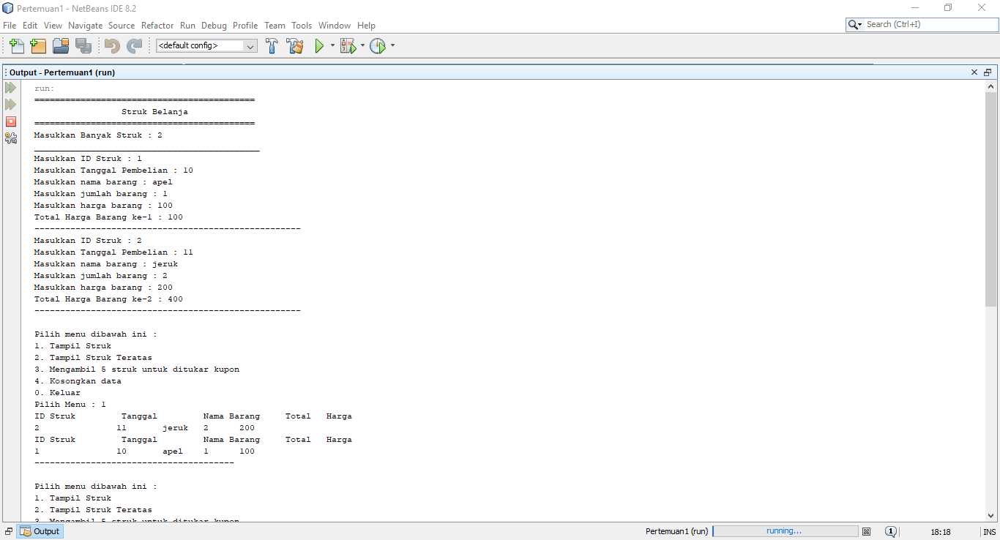
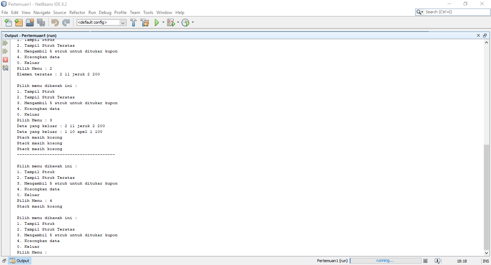

# Laporan Praktikum Pertemuan 3
Oleh : Muhammad Islahuddin 2141720268

## Jawaban Pertanyaan

### Sub Bab 7.2.3
1. Banyaknya data yang dapat ditampung yaitu 5.
2. Data yang tersimpan dalam parameter p tersebut adalah data pakaian yang bersisi jenis, warna, merk, ukuran, harga dari pakaian yang baru ditambahkan.
3. Agar input data kedalam stack dapat dilakukan berulang kali dan akan berhenti jika stack penuh atau user menghentikan pengisian data.

### Sub Bab 7.3.3
1. Method derajat digunakan untuk mengetahui seberapa besar nilai operator yang digunakan. Sebuah data (operator) yang bertipe char akan masuk ke dalam method derajat lalu di cek satu persatu dalam sintaks switch case. Jika operator sama dengan ^ maka akan mereturn nilai 3 atau nilai tertinggi dari sebuah derajat operator. Jika operator tidak sama dengan ^, namun sama dengan % maka akan mereturn nilai 2. Jika operator tidak sama dengan ^ dan %, namun sama dengan / maka akan mereturn nilai 2. Jika operator tidak sama dengan ^,%, dan /, namun sama dengan * maka akan mereturn nilai 2. Jika operator tidak sama dengan – atau + maka akan mereturn nilai 1.
2. Variabel c digunakan untuk menyimpan data char i ke dalam variable Q melalui sintaks charAt(i).
4. Tanda kurung tidak ditampilkan dalam konversi karena hanya sebagai pembatas atau menanda dalam sintaks infix yang dirubah ke postfix.

### Tugas

&copy islaarema31
